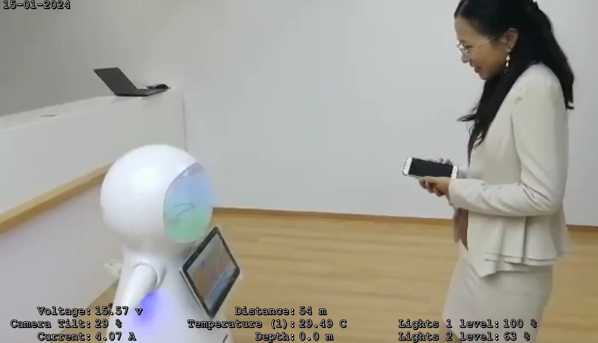

<p align="center"></p>
<h1 align="center"> subtitle SRT/ASS for videos </h1> 
<h4 align="right">February 24</h4>

<br>

El subtítulo en formato ASS o SRT debe estar en el mismo directorio que el video. Debe poseer el mismo nombre que el video. Sample:

<p align="center"></p>


# Fomato .ASS
Sample format 3s
```
[Script Info]
Title: QGroundControl Subtitle Telemetry file
ScriptType: v4.00+
WrapStyle: 0
ScaledBorderAndShadow: yes
YCbCr Matrix: TV.601
PlayResX: 1920
PlayResY: 1080

[V4+ Styles]
Format: Name, Fontname, Fontsize, PrimaryColour, SecondaryColour, OutlineColour, BackColour, Bold, Italic, Underline, StrikeOut, ScaleX, ScaleY, Spacing, Angle, BorderStyle, Outline, Shadow, Alignment, MarginL, MarginR, MarginV, Encoding
Style: Default,Monospace,30,&H00FFFFFF,&H000000FF,&H00000000,&H00000000,0,0,0,0,100,100,0,0,1,2,2,1,10,10,10,1

[Events]
Format: Layer, Start, End, Style, Name, MarginL, MarginR, MarginV, Effect, Text

Dialogue: 0,0:00:00.0,0:00:01.0,Default,,0,0,0,,{\an3\pos(295,1075)}Voltage:\NCamera Tilt:\NCurrent:
Dialogue: 0,0:00:00.0,0:00:01.0,Default,,0,0,0,,{\pos(305,1075)}15.42 v\N29 %\N8.68 A
Dialogue: 0,0:00:00.0,0:00:01.0,Default,,0,0,0,,{\an3\pos(950,1075)}Pilot Gain:\NTemperature (1):\NDepth:
Dialogue: 0,0:00:00.0,0:00:01.0,Default,,0,0,0,,{\pos(960,1075)}50 m\N29.48 C\N0.0 m
Dialogue: 0,0:00:00.0,0:00:01.0,Default,,0,0,0,,{\an3\pos(1605,1075)}Lights 1 level:\NLights 2 level:
Dialogue: 0,0:00:00.0,0:00:01.0,Default,,0,0,0,,{\pos(1615,1075)}100 %\N63 %

Dialogue: 0,0:00:00.0,0:00:01.0,Default,,0,0,0,,{\pos(10,35)}15-01-2024 
Dialogue: 0,0:00:01.0,0:00:02.0,Default,,0,0,0,,{\an3\pos(295,1075)}Voltage:\NCamera Tilt:\NCurrent:
Dialogue: 0,0:00:01.0,0:00:02.0,Default,,0,0,0,,{\pos(305,1075)}15.26 v\N29 %\N12.94 A
Dialogue: 0,0:00:01.0,0:00:02.0,Default,,0,0,0,,{\an3\pos(950,1075)}Pilot Gain:\NTemperature (1):\NDepth:
Dialogue: 0,0:00:01.0,0:00:02.0,Default,,0,0,0,,{\pos(960,1075)}51 m\N29.48 C\N0.0 m
Dialogue: 0,0:00:01.0,0:00:02.0,Default,,0,0,0,,{\an3\pos(1605,1075)}Lights 1 level:\NLights 2 level:
Dialogue: 0,0:00:01.0,0:00:02.0,Default,,0,0,0,,{\pos(1615,1075)}100 %\N63 %

Dialogue: 0,0:00:01.0,0:00:02.0,Default,,0,0,0,,{\pos(10,35)}15-01-2024 
Dialogue: 0,0:00:02.0,0:00:03.0,Default,,0,0,0,,{\an3\pos(295,1075)}Voltage:\NCamera Tilt:\NCurrent:
Dialogue: 0,0:00:02.0,0:00:03.0,Default,,0,0,0,,{\pos(305,1075)}15.24 v\N29 %\N12.92 A
Dialogue: 0,0:00:02.0,0:00:03.0,Default,,0,0,0,,{\an3\pos(950,1075)}Pilot Gain:\NTemperature (1):\NDepth:
Dialogue: 0,0:00:02.0,0:00:03.0,Default,,0,0,0,,{\pos(960,1075)}52 m\N29.48 C\N0.0 m
Dialogue: 0,0:00:02.0,0:00:03.0,Default,,0,0,0,,{\an3\pos(1605,1075)}Lights 1 level:\NLights 2 level:
Dialogue: 0,0:00:02.0,0:00:03.0,Default,,0,0,0,,{\pos(1615,1075)}100 %\N63 %
```

Desglose
```
## cambiar tamaño de la fuente
Style: Default,Monospace,<<<<<< 30 >>>>>>,&H00FFFFFF,&H000000FF,&H00000000,&H00000000,0,0,0,0,100,100,0,0,1,2,2,1,10,10,10,1

## cada bloque de este codigo es un segundo de video
Dialogue: 0,0:00:01.0,0:00:02.0,Default,,0,0,0,,{\pos(10,35)}15-01-2024 
Dialogue: 0,0:00:02.0,0:00:03.0,Default,,0,0,0,,{\an3\pos(295,1075)}Voltage:\NCamera Tilt:\NCurrent:
Dialogue: 0,0:00:02.0,0:00:03.0,Default,,0,0,0,,{\pos(305,1075)}15.24 v\N29 %\N12.92 A
Dialogue: 0,0:00:02.0,0:00:03.0,Default,,0,0,0,,{\an3\pos(950,1075)}Pilot Gain:\NTemperature (1):\NDepth:
Dialogue: 0,0:00:02.0,0:00:03.0,Default,,0,0,0,,{\pos(960,1075)}52 m\N29.48 C\N0.0 m
Dialogue: 0,0:00:02.0,0:00:03.0,Default,,0,0,0,,{\an3\pos(1605,1075)}Lights 1 level:\NLights 2 level:
Dialogue: 0,0:00:02.0,0:00:03.0,Default,,0,0,0,,{\pos(1615,1075)}100 %\N63 %

## etiquetas
Dialogue: 0,0:00:00.0,0:00:01.0,Default,,0,0,0,,{\an3\pos(295,1075)}Voltage:\NCamera Tilt:\NCurrent:
Voltage:
Camera Tilt:
Current:

## valores
Dialogue: 0,0:00:00.0,0:00:01.0,Default,,0,0,0,,{\pos(305,1075)}15.42 v\N29 %\N8.68 A
15.42 v
29%
8.68 A

## etiquetas
Dialogue: 0,0:00:00.0,0:00:01.0,Default,,0,0,0,,{\an3\pos(950,1075)}Pilot Gain:\NTemperature (1):\NDepth:
Pilot Gain:
Temperature (1):
Depth:

## valores
Dialogue: 0,0:00:00.0,0:00:01.0,Default,,0,0,0,,{\pos(960,1075)}50 %\N29.48 C\N0.0 m
50 %
29.48 C
0.0 m

## etiquetas
Dialogue: 0,0:00:00.0,0:00:01.0,Default,,0,0,0,,{\an3\pos(1605,1075)}Lights 1 level:\NLights 2 level:
Lights 1 level:
Lights 2 level:

## valores
Dialogue: 0,0:00:00.0,0:00:01.0,Default,,0,0,0,,{\pos(1615,1075)}100 %\N63 %
100 %
63 %
```
<br>

# Codigo de ejemplo para modificar un .ass existente
### este Script cambia el titulo del proyecto, aumenta el tamaño de la fuente, cambia una etiqueta por otra. lo hace en todo ell archivo de subtitulo.

```
const fs = require('fs');

// Ruta del archivo de texto
const filePath = '2024-01-15_11.13.52.ass';


// Objeto que contiene las palabras a buscar y sus respectivos reemplazos
const palabrasAReemplazar = {
    'QGroundControl Subtitle Telemetry file': 'Subtitle Telemetry file',
    'Monospace,30,&H00FFFFFF': 'Monospace,40,&H00FFFFFF',
    'Pilot Gain:': 'Distance:',
    // Agrega más palabras a buscar y sus reemplazos aquí si es necesario
};


// Función para leer el archivo y buscar la palabra
fs.readFile(filePath, 'utf8', (err, data) => {
  if (err) {
    console.error('Error al leer el archivo:', err);
    return;
  }


 // Reemplazar cada palabra en el contenido
 let nuevoContenido = data;
 for (let palabraBuscar in palabrasAReemplazar) {
   const palabraReemplazar = palabrasAReemplazar[palabraBuscar];
   nuevoContenido = nuevoContenido.replace(new RegExp(palabraBuscar, 'g'), palabraReemplazar);
 }

// Escribir el nuevo contenido en el archivo
 fs.writeFile(filePath, nuevoContenido, 'utf8', (err) => {
    if (err) {
        console.error('Error al escribir en el archivo:', err);
        return;
    }
    console.log('Archivo modificado correctamente.');
 });

});

```

<br>


---
Copyright &copy; 2022 [carjavi](https://github.com/carjavi). <br>
```www.instintodigital.net``` <br>
carjavi@hotmail.com <br>
<p align="center">
    <a href="https://instintodigital.net/" target="_blank"></a>
</p>


# subtitle-SRT-ASS-for-videos
subtitle-SRT-ASS-for-videos
